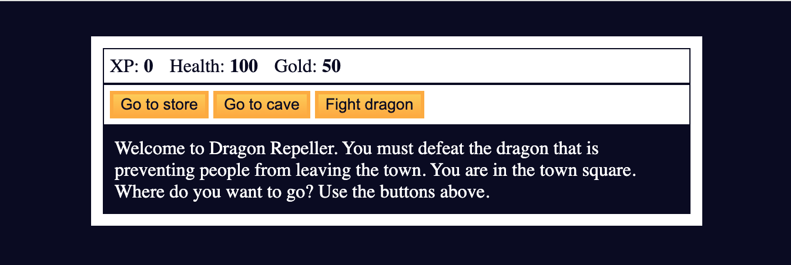

# RPG - Dragon Repeller

Welcome to Dragon Repeller, a simple RPG game where you must defeat the dragon that is terrorizing the town.

## Description

Dragon Repeller is a text-based RPG game built with HTML, CSS, and JavaScript. In this game, you navigate through different locations, fight monsters, upgrade your weapons, and ultimately face the dragon to save the town.

## Instructions

1. Open the `index.html` file in your web browser.
2. Click on the buttons to navigate through different locations and make choices.
3. Fight monsters by clicking the "Fight" button and choose your actions wisely.
4. Upgrade your health and weapons by visiting the store.
5. Defeat the dragon to win the game!

## Credits

This game was created following a tutorial from [freecodecamp.org](https://www.freecodecamp.org/). You can find the tutorial [here](https://www.freecodecamp.org/learn/javascript-algorithms-and-data-structures-v8/). Huge thanks to the team at freecodecamp for providing such valuable resources.

## Files

- `index.html`: HTML file containing the structure of the game.
- `styles.css`: CSS file for styling the game interface.
- `script.js`: JavaScript file containing the game logic.

## Preview

## Changelog

- Added dynamic monster attack value based on level.
- Implemented a chance for the monster to dodge the player's attack.
- Added a chance for the player's weapon to break during combat.
- Introduced a hidden easter egg game.

## License

This project is licensed under the BSD-3 License. See the [LICENSE](LICENSE) file for details.

---

Feel free to customize and enhance according to your preferences and needs! 